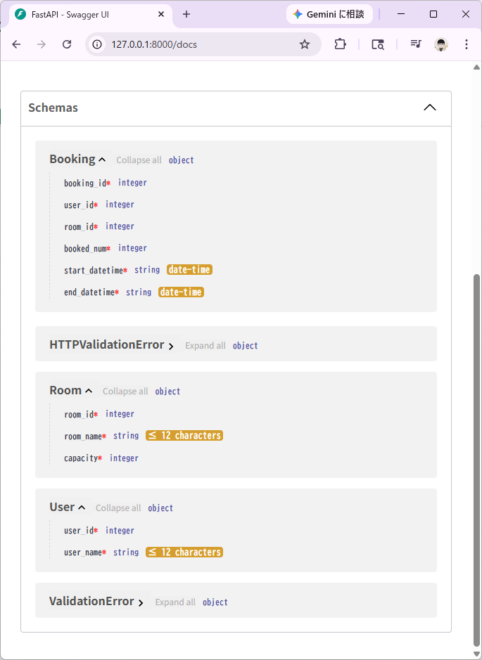
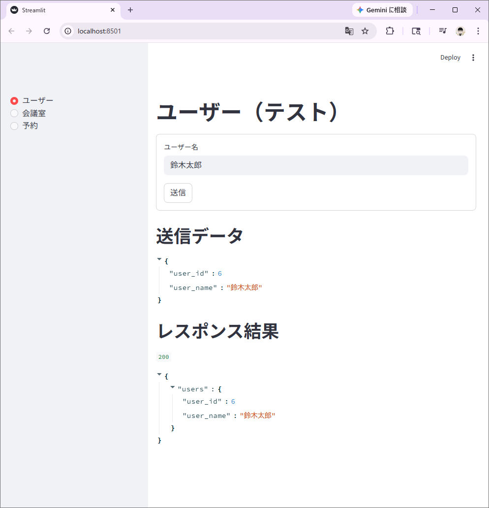
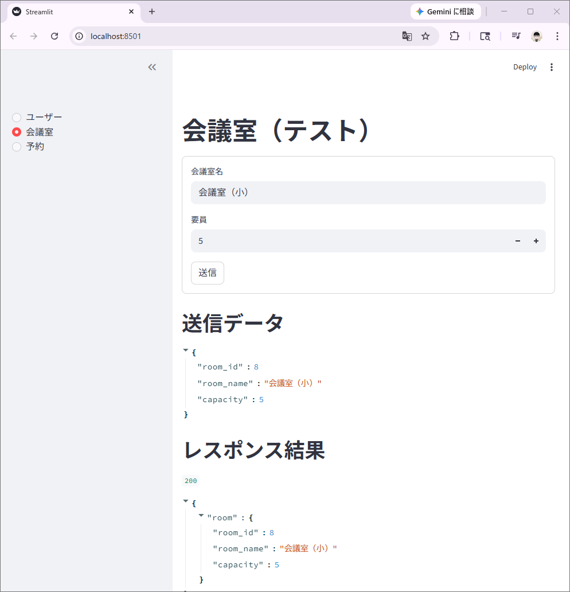
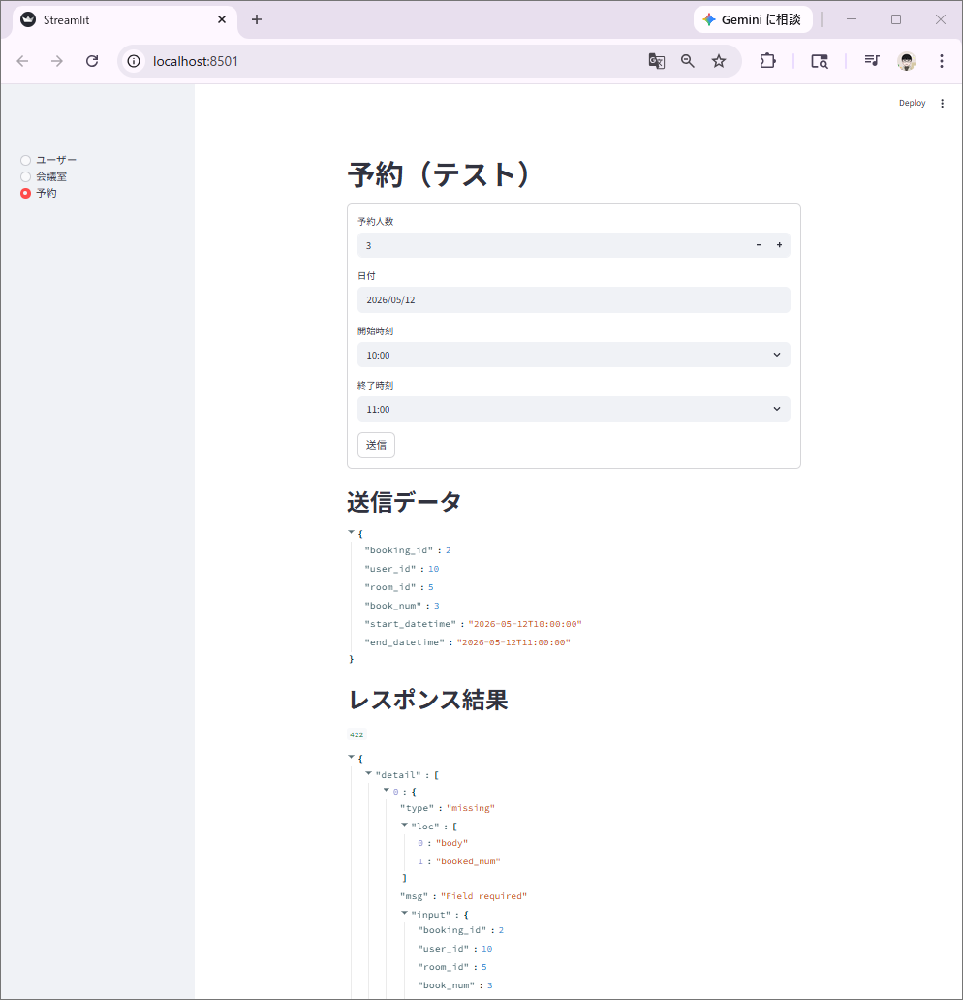
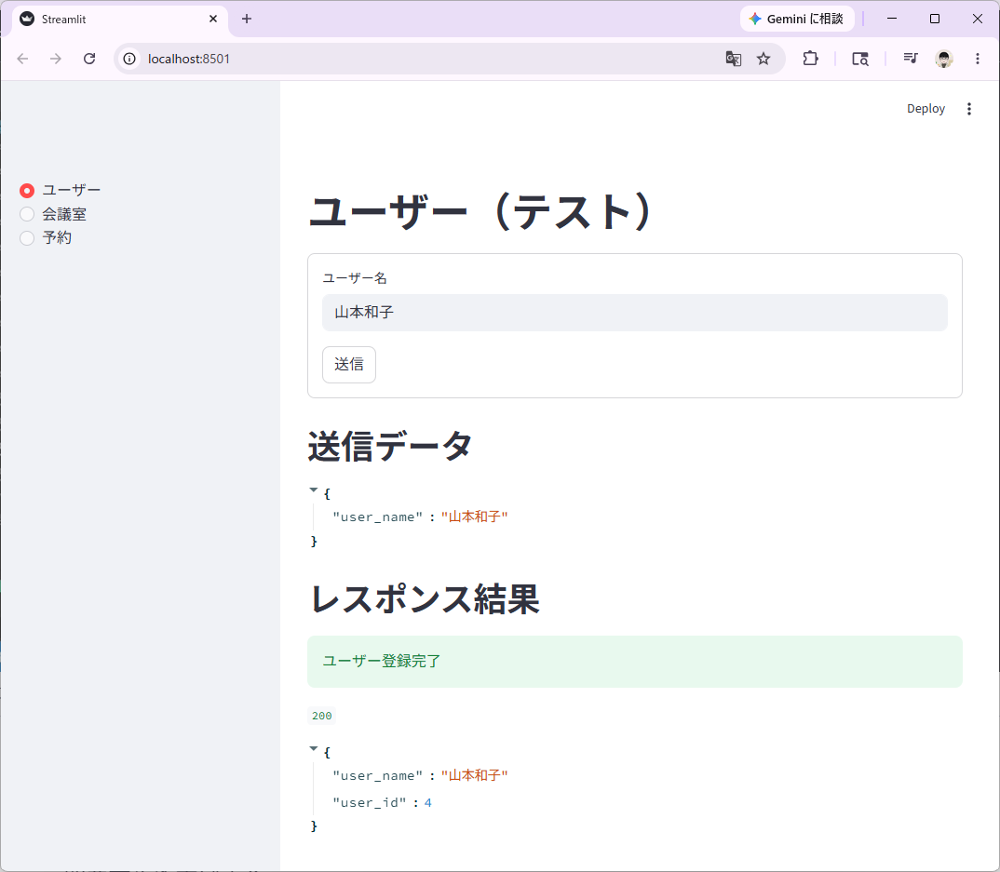

# 会議室予約システムAPI
[FastAPI](https://fastapi.tiangolo.com/ja/)と[Streamit](https://streamlit.io/)のフレームワークを用いて簡易的なWebサイトの会議室予約システムを構築する

## 環境構築
### 必要なパッケージ
- `FastAPI`
    ```
    pip install "fastapi[standard]"
    ```
- `Streamlit`
    ```
    pip install streamlit
    ```
- `SQLModel`
    ```
    pip install sqlmodel
    ```
    
    インストールしたパッケージをファイルで管理する

    ```
    pip freeze > requirements.txt
    ```

### SQLiteをPCにインストールする
1. [公式サイト](https://sqlite.org/download.html)からZIPファイルをダウンロードする
    `Precompiled Binaries for Windows`の`sqlite-tools-win-x64-3530100.zip`をダウンロードし、ZIP解凍後、`C:\Program Files\SQLite`直下にexeファイルを配置する
2. 環境変数の`Path`に`C:\Program Files\SQLite`を登録する
3. コマンドプロンプト起動し`sqlite3 --version`を実行し、問題なくバージョンが表示されればインストール完了！

## 第一章
### FastAPI(モデル)作成

main.py
```
import datetime
from fastapi import FastAPI
from pydantic import BaseModel, Field

class Booking(BaseModel):
    booking_id: int
    user_id: int
    room_id: int
    booked_num: int
    start_datetime: datetime.datetime
    end_datetime: datetime.datetime

class User(BaseModel):
    user_id: int
    user_name: str = Field(max_length=12)

class Room(BaseModel):
    room_id: int
    room_name: str = Field(max_length=12)
    capacity: int

app = FastAPI()

@app.get("/")
async def root():
    return { "message":"Success!" }

@app.post("/users/")
async def users(users: User):
    return { "users": users }

@app.post("/room/")
async def room(room: Room):
    return { "room": room }

@app.post("/booking/")
async def booking(booking: Booking):
    return { "booking": booking }
```

### Streamlitでユーザー画面作成

app.py
```
import streamlit as st
import datetime
import random
import requests

choice = st.sidebar.radio("",["ユーザー","会議室","予約"])

if choice == "ユーザー":

    st.title("ユーザー（テスト）")

    with st.form(key="user"):
        user_id: int = random.randint(0,10)
        user_name: str = st.text_input(label="ユーザー名",max_chars=12)
        data = {
            "user_id": user_id,
            "user_name": user_name
        }
        submit_button = st.form_submit_button(label="送信")

    if submit_button:
        st.write("## 送信データ ##")
        st.json(data)
        st.write("## レスポンス結果 ##")
        url = "http://127.0.0.1:8000/users"
        res = requests.post(url, json=data)
        st.write(res.status_code)
        st.json(res.json())

elif choice == "会議室":

    st.title("会議室（テスト）")

    with st.form(key="room"):
        room_id: int = random.randint(0,10)
        room_name: str = st.text_input(label="会議室名",max_chars=12)
        capacity: int = st.number_input(label="要員",step=1)
        data = {
            "room_id": room_id,
            "room_name": room_name,
            "capacity": capacity
        }
        submit_button = st.form_submit_button(label="送信")

    if submit_button:
        st.write("## 送信データ ##")
        st.json(data)
        st.write("## レスポンス結果 ##")
        url = "http://127.0.0.1:8000/room"
        res = requests.post(url, json=data)
        st.write(res.status_code)
        st.json(res.json())

elif choice == "予約":

    st.title("予約（テスト）")

    with st.form(key="room"):
        booking_id: int = random.randint(0,10)
        user_id: int = random.randint(0,10)
        room_id: int = random.randint(0,10)
        booked_num: int = st.number_input(label="予約人数",step=1)
        date = st.date_input(label="日付", min_value=datetime.datetime.today())
        start_time = st.time_input(label="開始時刻", value=datetime.time(hour=9,minute=0))
        end_time = st.time_input(label="終了時刻", value=datetime.time(hour=20,minute=0))
        data = {
            "booking_id": booking_id,
            "user_id": user_id,
            "room_id": room_id,
            "book_num": booked_num,
            "start_datetime": datetime.datetime(
                year=date.year,
                month=date.month,
                day=date.day,
                hour=start_time.hour,
                minute=start_time.minute
            ).isoformat(),
            "end_datetime": datetime.datetime(
                year=date.year,
                month=date.month,
                day=date.day,
                hour=end_time.hour,
                minute=end_time.minute
            ).isoformat()
        }
        submit_button = st.form_submit_button(label="送信")

    if submit_button:
        st.write("## 送信データ ##")
        st.json(data)
        st.write("## レスポンス結果 ##")
        url = "http://127.0.0.1:8000/booking"
        res = requests.post(url, json=data)
        st.write(res.status_code)
        st.json(res.json())
```

### 作成したFastAPIとStreamlitの画面を確認する

1. ターミナルでサーバーを起動する
    ```
    fastapi dev
    ```

2. `http://127.0.0.1:8000/docs`へアクセスする

    `Schemas`で`main.py`で作成した`User`、`Room`、`Booking`クラスの変数を確認する

    

3. 新しくターミナルを起動し`app.py`で作成した各画面を`streamlit`で確認する
    ```
    streamlit run app.py
    ```

    上記コマンドを実行するとブラウザが立ち上がり画面を確認できる

- ユーザー画面の確認
    サブメニューから`ユーザー`を選択し、ユーザー名に`鈴木太郎`を入力し送信ボタンを押下すると、送信データとレスポンス結果（200）が表示されれば成功！
    

- 会議室画面の確認
    サブメニューから`会議室`を選択し、会議室名に`会議室（小）`を、要員に`5`を入力し送信ボタンを押下すると、送信データとレスポンス結果（200）が表示されれば成功！
    

- 予約画面の確認
    サブメニューから`予約`を選択し、予約人数に`3`を、日付に`2026/05/12`を、開始時刻に`10:00`を、終了時刻に`11:00`を入力し送信ボタンを押下すると、送信データとレスポンス結果（200）が表示されれば成功！
    

## 第二章
### データベースを構築する

1. データベースをSQLiteとする設定を用意する

    sql_app\database.py
    ```
    from typing import Annotated
    from fastapi import Depends
    from sqlmodel import create_engine, Session

    # SQLite設定
    SQLITE_FILE_NAME= "database.db"
    SQLITE_URL = f"sqlite:///{SQLITE_FILE_NAME}"
    CONNECT_ARGS = { "check_same_thread": False }

    # SQLiteエンジン設定
    engine = create_engine(SQLITE_URL, connect_args=CONNECT_ARGS)

    # Session依存関係の作成
    def get_session():
        with Session(engine) as session:
            yield session

    # SessionDependency型
    SessionDep = Annotated[Session, Depends(get_session)]
    ```

2. DBにテーブルを作成する

    sql_app\models.py
    ```
    import datetime
    from sqlmodel import SQLModel, Field, Relationship

    class User(SQLModel, table=True):
        user_id: int | None = Field(default=None, primary_key=True)
        user_name: str = Field(max_length=12)

        booking: list["Booking"] = Relationship(back_populates="user")

    class Room(SQLModel, table=True):
        room_id: int | None = Field(default=None, primary_key=True)
        room_name: str = Field(max_length=12)
        capacity: int

        booking: list["Booking"] = Relationship(back_populates="room")


    class Booking(SQLModel, table=True):
        booking_id: int | None = Field(default=None, primary_key=True)
        user_id: int | None = Field(default=None, foreign_key="user.user_id",ondelete="CASCADE")
        room_id: int | None = Field(default=None, foreign_key="room.room_id",ondelete="CASCADE")
        booked_num: int
        start_datetime: datetime.datetime
        end_datetime: datetime.datetime

        user: User = Relationship(back_populates="booking")
        room: Room = Relationship(back_populates="booking")
    ```

3. `main.py`で記述した`User`、`Room`、`Booking`クラスを`sql_app\schemas.py`に移動する

    sql_app\schemas.py
    ```
    import datetime
    from pydantic import BaseModel, Field, ConfigDict

    class BookingBaseModel(BaseModel):
        user_id: int
        room_id: int
        booked_num: int
        start_datetime: datetime.datetime
        end_datetime: datetime.datetime

    class Booking(BookingBaseModel):
        booking_id: int

        model_config = ConfigDict(from_attributes=True)

    class UserBaseModel(BaseModel):
        user_name: str = Field(max_length=12)

    class User(UserBaseModel):
        user_id: int

        model_config = ConfigDict(from_attributes=True)

    class RoomBaseModel(BaseModel):
        room_name: str = Field(max_length=12)
        capacity: int

    class Room(RoomBaseModel):
        room_id: int

        model_config = ConfigDict(from_attributes=True)
    ```

4. `sql_app\crud.py`で各テーブル一覧を取得する関数を用意する

    sql_app\crud.py
    ```
    from typing import Annotated
    from fastapi import Query
    from .database import SessionDep
    from .models import User, Room, Booking
    from . import schemas
    from sqlmodel import select

    # ユーザー一覧取得
    def read_users(
            session: SessionDep,
            offset: int=0, 
            limit: Annotated[int,Query(le=100)]= 100,
        ) -> list[schemas.User]:
        users = session.exec(select(User).offset(offset).limit(limit)).all()
        return users

    # 会議室一覧取得
    def read_rooms(
            session: SessionDep,
            offset: int=0, 
            limit: Annotated[int,Query(le=100)]= 100,
            ) -> list[schemas.Room]:
            rooms = session.exec(select(Room).offset(offset).limit(limit)).all()
            return rooms

    # 予約一覧取得
    def read_bookings(
            session: SessionDep,
            offset: int=0, 
            limit: Annotated[int,Query(le=100)]= 100,
            ) -> list[schemas.Booking]:
            bookings = session.exec(select(Booking).offset(offset).limit(limit)).all()
            return bookings
    ```

5. `sql_app\crud.py`に各テーブルにレコードを追加する関数を追記する

    sql_app\crud.py
    ```
    from typing import Annotated
    from fastapi import Query
    from .database import SessionDep
    from .models import User, Room, Booking
    from . import schemas
    from sqlmodel import select

    # ユーザー一覧取得
    def read_users(
            session: SessionDep,
            offset: int=0, 
            limit: Annotated[int,Query(le=100)]= 100,
        ) -> list[schemas.User]:
        users = session.exec(select(User).offset(offset).limit(limit)).all()
        return users

    # 会議室一覧取得
    def read_rooms(
            session: SessionDep,
            offset: int=0, 
            limit: Annotated[int,Query(le=100)]= 100,
            ) -> list[schemas.Room]:
            rooms = session.exec(select(Room).offset(offset).limit(limit)).all()
            return rooms

    # 予約一覧取得
    def read_bookings(
            session: SessionDep,
            offset: int=0, 
            limit: Annotated[int,Query(le=100)]= 100,
            ) -> list[schemas.Booking]:
            bookings = session.exec(select(Booking).offset(offset).limit(limit)).all()
            return bookings

    # 会議室作成
    def create_room(room: schemas.RoomBaseModel, session: SessionDep) -> schemas.Room:
        db_room = Room.model_validate({"room_name": room.room_name, "capacity": room.capacity})
        session.add(db_room)
        session.commit()
        session.refresh(db_room)
        return schemas.Room.from_orm(db_room)

    # ユーザー作成
    def create_user(user: schemas.UserBaseModel, session: SessionDep) -> schemas.User:
        db_user = User.model_validate({"user_name": user.user_name})
        session.add(db_user)
        session.commit()
        session.refresh(db_user)
        return schemas.User.from_orm(db_user)

    # 予約作成
    def create_booking(booking: Booking, session: SessionDep) -> Booking:
        db_booking = Booking(
            user_id=booking.user_id,
            room_id=booking.room_id,
            booked_num=booking.booked_num,
            start_datetime=booking.start_datetime,
            end_datetime=booking.end_datetime)
        session.add(db_booking)
        session.commit()
        session.refresh(db_booking)
        return db_booking
    ```

6. `main.py`を`sql_app`へ移動し修正する

    sql_app\main.py
    ```
    from typing import List
    from sqlmodel import SQLModel
    from fastapi import FastAPI
    from .schemas import UserBaseModel,User, RoomBaseModel,Room, BookingBaseModel,Booking
    from .database import engine, SessionDep
    from . import crud

    # テーブル作成
    SQLModel.metadata.create_all(bind=engine)

    # FastAPIアプリケーション初期化
    app = FastAPI()

    """
    Read
        一覧を取得する
    """
    @app.get("/users", response_model=List[User])
    async def read_users(session:SessionDep,offset: int=0, limit: int=100):
        return crud.read_users(session=session, offset=offset, limit=limit)

    @app.get("/rooms", response_model=List[Room])
    async def read_rooms(session:SessionDep, offset: int=0, limit: int=100):
        return crud.read_rooms(session=session, offset=offset, limit=limit)

    @app.get("/bookings", response_model=List[Booking])
    async def read_bookings(session:SessionDep, offset: int=0, limit: int=100):
        return crud.read_bookings(session=session, offset=offset, limit=limit)

    """
    Create
        データを作成する
    """
    @app.post("/user", response_model=User)
    async def create_user(user: UserBaseModel,session:SessionDep):
        return crud.create_user(user=user, session=session)

    @app.post("/room", response_model=Room)
    async def create_room(room: RoomBaseModel, session:SessionDep):
        return crud.create_room(room=room, session=session)

    @app.post("/booking", response_model=Booking)
    async def create_booking(booking: BookingBaseModel,session:SessionDep):
        return crud.create_booking(booking=booking, session=session)
    ```

7. コードが問題がないかFastAPIサーバーを起動して確認する

    新しくターミナルを起動し以下コマンドを実行する
    ```
    fastapi dev sql_app\main.py
    ```

    次の通り返ってきたら成功！
    ```
    Starting development server 🚀
 
             Searching for package file structure from directories 
             with __init__.py files                                
             Importing from                                        
             C:\Users\user\Documents\github\test-booking-fastapi   
 
    module   📁 sql_app        
             ├── 🐍 __init__.py
             └── 🐍 main.py    
 
      code   Importing the FastAPI app object from the module with 
             the following code:                                   
 
             from sql_app.main import app
 
       app   Using import string: sql_app.main:app
 
    server   Server started at http://127.0.0.1:8000
    server   Documentation at http://127.0.0.1:8000/docs
 
       tip   Running in development mode, for production use:      
             fastapi run                                           
 
             Logs:
 
      INFO   Will watch for changes in these directories:          
             ['C:\\Users\\user\\Documents\\github\\test-booking-fas
             tapi']
      INFO   Uvicorn running on http://127.0.0.1:8000 (Press CTRL+C
             to quit)
      INFO   Started reloader process [10024] using WatchFiles
      INFO   Started server process [21460]
      INFO   Waiting for application startup.
      INFO   Application startup complete.
    ```

    ※`database.db`が生成されていることも確認する

8. 新しくターミナルを起動し画面をユーザー登録する

    次の通り返ってきたら成功！
    ```
    2026-05-13 11:34:21.857 Uvicorn server started on 0.0.0.0:8501

    You can now view your Streamlit app in your browser.

    Local URL: http://localhost:8501
    Network URL: http://192.168.10.6:8501

    Stopping...
    ```

    次の通り登録できれば成功！
    
